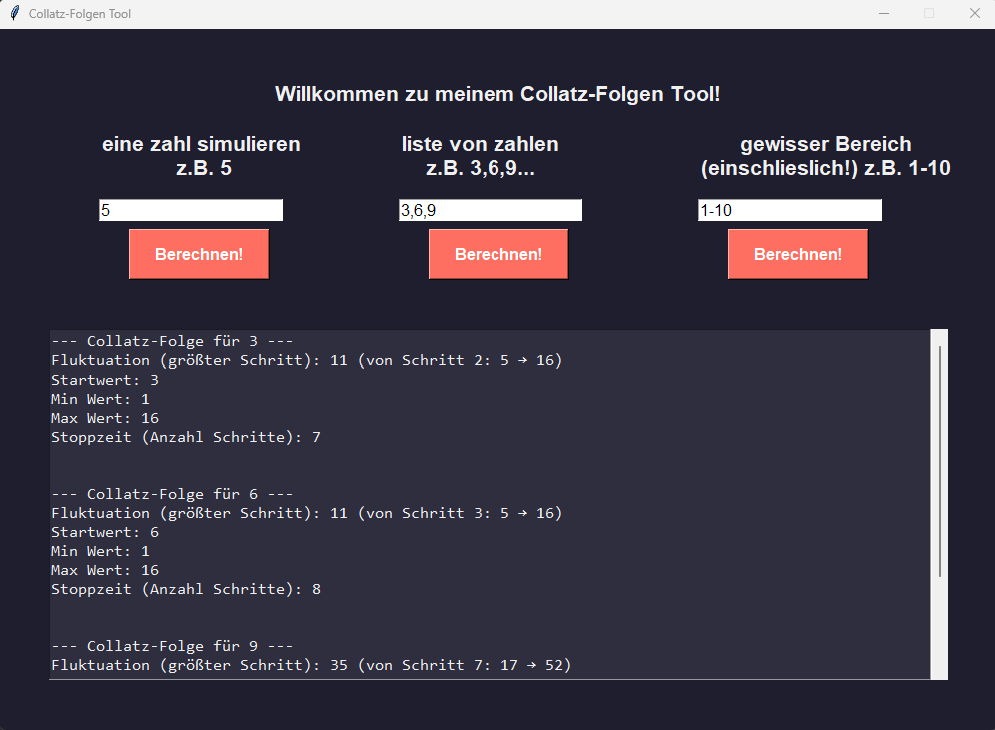
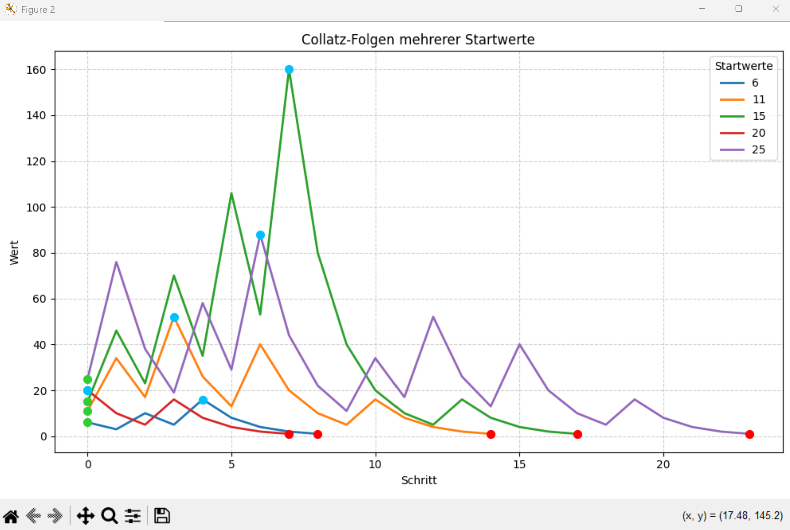

# Collatz-tool
GUI tool to calculate and plot Collatz sequences for single numbers, lists, and ranges.

## ✨ Features

- Simulate the Collatz sequence for:
  - A **single number**
  - A **custom list** of numbers
  - A **number range**
- Visual plots showing:
  - Start value (green)
  - Highest value reached (blue)
  - Stop time (red)
- Simple and modern GUI built in pure Python

## Examples

- First enter your number(s) exactly as shown in the labels:
  - Single number: `5`
  - List of numbers: `3,6,9`
  - Range (inclusive): `1-10`
 


- Then click "Calculate!" to plot your input.



## 🧠 About the Collatz Sequence

For any positive integer `n`:
- If `n` is even → divide it by 2  
- If `n` is odd → multiply by 3 and add 1

Repeat until you reach 1.  
Despite its simplicity, the sequence exhibits surprisingly complex behavior — a famous unsolved problem in mathematics.

## Installation

1. Open a terminal (Git Bash, PowerShell, or CMD).  
2. Clone the repository:

```bash
git clone https://github.com/rodin04/Collatz-tool.git
```

3. Navigate to the project folder.
```bash
cd your_folder_path!!!
```

4. Install requirements.txt
```bash
pip install -r requirements.txt
```

## Start programm

1. Open a terminal (Git Bash, PowerShell, or CMD).
2. Navigate to the project folder.
```bash
cd your_folder_path!!!
```
3. Start python script
```bash
python collatz_tool.py
```

## Requirements

- **Python 3.10+**
- **Tkinter** — standard library (included with most Python installations)
- **Matplotlib 3.7+** (`matplotlib==3.7.2`) — for plotting Collatz sequences

